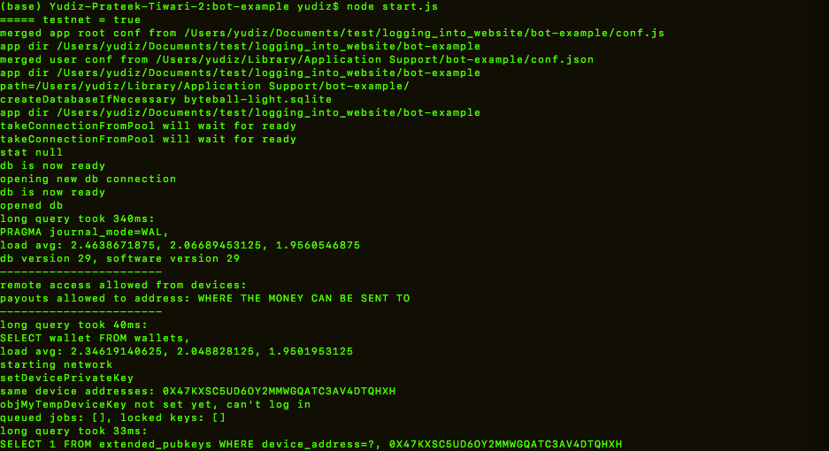
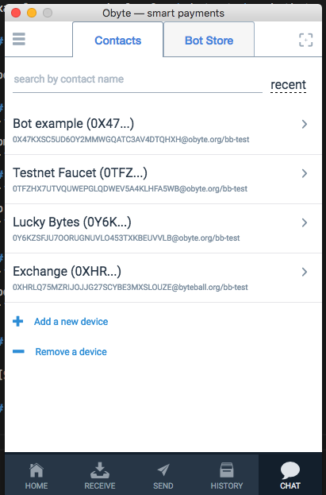
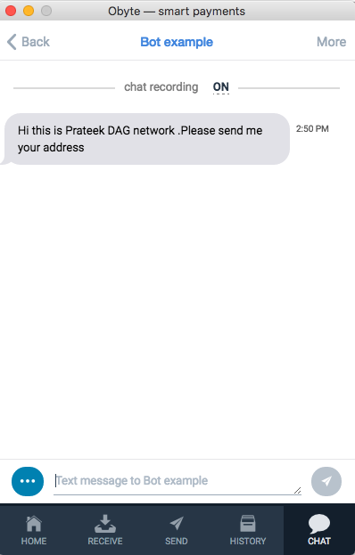
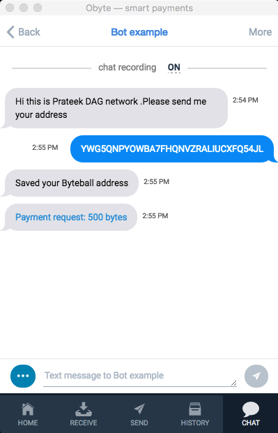
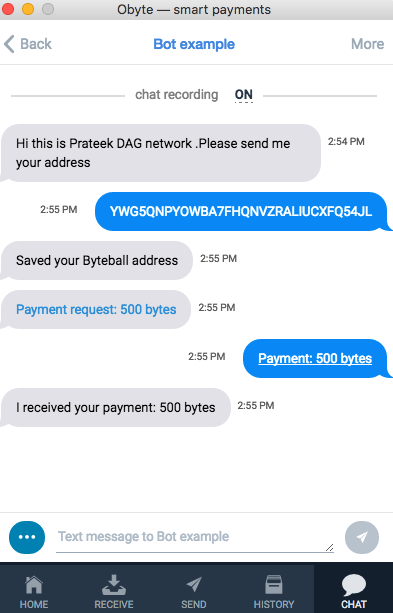
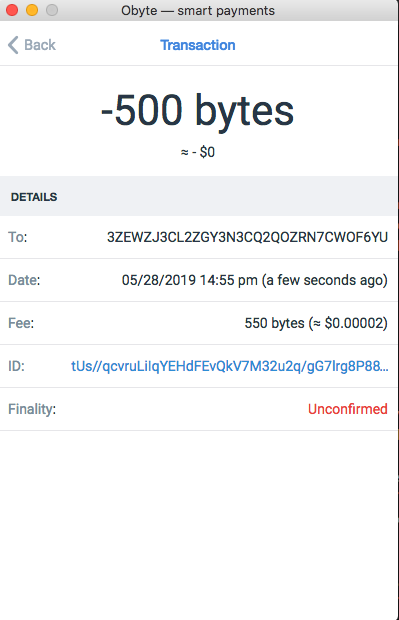

# Bot Example

Example source code for O<sub>byte</sub> chatbot.  Copy this bot and start adding your stuff.

## Requirements

node.js 6+

## Install
```
npm install
```
## Make sure you have done 
```
cp .env.testnet .env
```

## Run
```
node start.js
```

## Output looks like 



## Open the Obyte wallet and add new device. 



###  Add your device pairing in the add new wallet. You can check it on node start.js screen.



### Paste your address of Obyte wallet and have a look :) .



### Do the payment and wait for revert back from bot after success.



### Check the transaction in the wallet to confirm .




